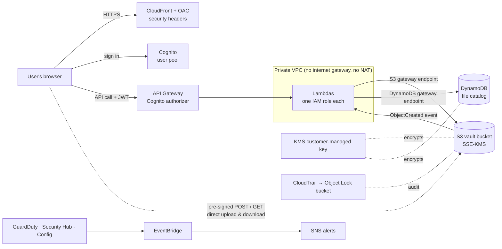

# 🔐 AWS Secure Vault

A serverless file vault on AWS, built **security-first** and entirely with **Terraform**. Users sign in, upload files straight to encrypted S3 storage, and can only ever reach their own files. The design is driven by a STRIDE threat model, and every control is verified with a test.

> **Status: in progress. Target v1.0: mid-October 2026.**
> The data, identity and network layers are built and verified (see [Progress](#-progress)). The Lambda API, frontend, CI/CD pipeline and detection stack are next.

---

## 🧭 Architecture



**How an upload works**
1. The user signs in with Cognito and gets a short-lived JWT (15 minutes).
2. The browser asks the API for an upload link. API Gateway rejects any request without a valid token before any code runs.
3. The `requestUpload` Lambda takes the user's identity **from the verified token, never from the request**, and returns a **pre-signed POST** that is locked to the path `userId/fileId`, capped at 100 MB and valid for 5 minutes.
4. The browser uploads **directly to S3**, and S3 encrypts the file with the vault's KMS key. The backend never handles file contents.
5. The S3 event triggers `onUploadComplete`, which records the file in DynamoDB under its owner.
6. For downloads and deletes, each Lambda **checks ownership** in DynamoDB first (IDOR protection).

---

## ✅ Progress

| Layer | Status | What's there | Evidence |
|---|---|---|---|
| Terraform remote state | ✅ Built | S3 state bucket: versioned, SSE-KMS, public access blocked, HTTPS-only, native S3 locking, `prevent_destroy` | [`bootstrap/`](bootstrap/) |
| Encryption (KMS) | ✅ Built | Customer-managed key, automatic yearly rotation | [`terraform/kms.tf`](terraform/kms.tf) |
| File storage (S3) | ✅ Built | Versioning, SSE-KMS with the vault key, public access blocked, ACLs disabled, HTTPS-only, **bucket policy denies uploads requesting any other KMS key**, 30-day retention of old versions | [`storage.tf`](terraform/storage.tf) · [test](screenshots/day1-encryption-enforced.png) |
| File catalog (DynamoDB) | ✅ Built | Keyed by `ownerId` + `fileId`, on-demand, point-in-time recovery, encrypted with the vault key | [`dynamodb.tf`](terraform/dynamodb.tf) · [test](screenshots/day1-dynamodb-catalog-tests.png) |
| Identity (Cognito) | ✅ Built | 12-character password policy, optional TOTP MFA (no SMS), user-enumeration protection, 15-minute tokens, refresh-token revocation, SRP login (no client secret in the browser) | [`cognito.tf`](terraform/cognito.tf) · [test](screenshots/day1-cognito-signup-tests.png) |
| Private network (VPC) | ✅ Built | 2 private subnets in 2 AZs, **no internet gateway or NAT**; S3 and DynamoDB gateway endpoints with **policies restricted to the vault bucket and table**; Lambda security group allows only HTTPS out to those two services | [`network.tf`](terraform/network.tf) · [test](screenshots/day2-network-no-internet.png) |
| Threat model (STRIDE) | 🟡 In progress | Assets, 9 trust boundaries, 15 threats mapped to controls, accepted risks | [`docs/ThreatModel.md`](docs/ThreatModel.md) |
| Lambdas + least-privilege IAM | ⏳ Next | `requestUpload`, `onUploadComplete`, `listFiles`, `downloadFile`, `deleteFile` (Python 3.13), one IAM role per function | |
| API Gateway | ⏳ Planned | REST API, Cognito authorizer, throttling, access logs | |
| Frontend | ⏳ Planned | Private S3 + CloudFront (OAC), CSP/HSTS headers | |
| CI/CD | ⏳ Planned | GitHub Actions with **OIDC (no stored AWS keys)**: gitleaks, Bandit, pytest, Checkov, `terraform plan`/`apply` | |
| Logging & detection | ⏳ Planned | CloudTrail to an Object Lock bucket, CloudWatch alarms, GuardDuty / Security Hub / Config behind a cost flag, EventBridge → SNS | |

---

## 🛡️ Security highlights

- **Identity is the perimeter.** A user's identity comes only from the verified JWT (`sub`), never from request data. Every file operation checks ownership.
- **Encryption you control.** A customer-managed KMS key encrypts both S3 and DynamoDB, and the bucket policy refuses any upload that asks for a different key. *(Verified: a different key → `AccessDenied`; no key → stored with the vault key.)*
- **No path to the internet.** The Lambdas run in private subnets with no internet gateway or NAT. They reach S3 and DynamoDB only through gateway endpoints whose policies allow **only this vault's bucket and table**, so a compromised function can't exfiltrate data. *(Verified: no IGW, no NAT, no `0.0.0.0/0` route.)*
- **Least privilege everywhere.** One IAM role per Lambda. No long-lived access keys: humans use `aws login` with MFA, and CI will use GitHub OIDC.
- **Threat-model driven.** Controls trace back to STRIDE threats, and deliberate trade-offs are documented as accepted risks.

---

## 💰 Cost

Designed to cost about **$1–2/month when idle**. The only fixed cost is the KMS key (~$1/month). Everything else is on-demand or free (VPC, gateway endpoints, Lambda, DynamoDB on-demand). No NAT gateway, which saves ~$32/month. Paid detection services (GuardDuty, Security Hub, Config, WAF) will sit behind Terraform feature flags that are off by default.

---

## 🧰 Tech stack

**AWS:** S3, KMS, DynamoDB, Cognito, VPC and gateway endpoints, Lambda, API Gateway, CloudFront, CloudTrail, CloudWatch, GuardDuty, Security Hub, Config, EventBridge, SNS
**IaC:** Terraform 1.16 (AWS provider 6.x), remote state in S3 with native locking
**Code:** Python 3.13 (boto3), pytest
**DevSecOps:** GitHub Actions, OIDC, gitleaks, Bandit, Checkov

---

## 📁 Repository layout

```
bootstrap/          Terraform for the remote-state bucket (applied once)
terraform/          Main infrastructure: kms, storage, dynamodb, cognito, network, ...
backend/functions/  Lambda functions (Python)
frontend/           Static web app
tests/              pytest suites, including IDOR tests
docs/               Threat model, architecture diagrams, ADRs
screenshots/        Test evidence
```

---

## 🗺️ Roadmap after v1.0

- Auto-remediation: an EventBridge rule plus a Lambda that re-blocks a bucket if it's made public
- Attack simulation with Stratus Red Team, and a detection-coverage report
- AWS WAF on the API (behind a flag)
- File sharing between users
- Required MFA
